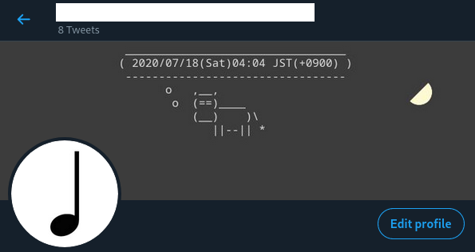

# Twitter Header Clock

## About

This project makes your Twitter header behave like a clock. Internally, it

1. creates a image in which a date string is displayed,

2. and uploads the image as a header image

every 60 seconds.

|  |
|:-:|
| Fig: An example result. |

## Requirements

- [`python-twitter` library](https://github.com/bear/python-twitter)

- [`Pillow` library](https://pillow.readthedocs.io/en/stable/)

- [`cowsay` command](https://en.wikipedia.org/wiki/Cowsay)

- An account for [Twitter Developer](https://developer.twitter.com/en) (see [Preparations](#preparations))

## Preparations

1. Credentials

    1. Create an account for [Twitter Developer](https://developer.twitter.com/en).

    2. Get API keys from the developer center.

    3. Create a file `twitter_credentials.json` in this project directory. It shall be of the form

    ```
    {
        "api_key":             "<api key>",
        "api_secret_key":      "<api secret key>",
        "access_token":        "<access token>",
        "access_token_secret": "<access token secret>"
    }
    ```

2. Parameters

    1. Change the contents of `./config.json` as you like. This file specifies a directory for temporary files, the name of a font, and so on.

## Usage

```bash
$ python3 main.py
```

<!-- vim: set spell: -->

